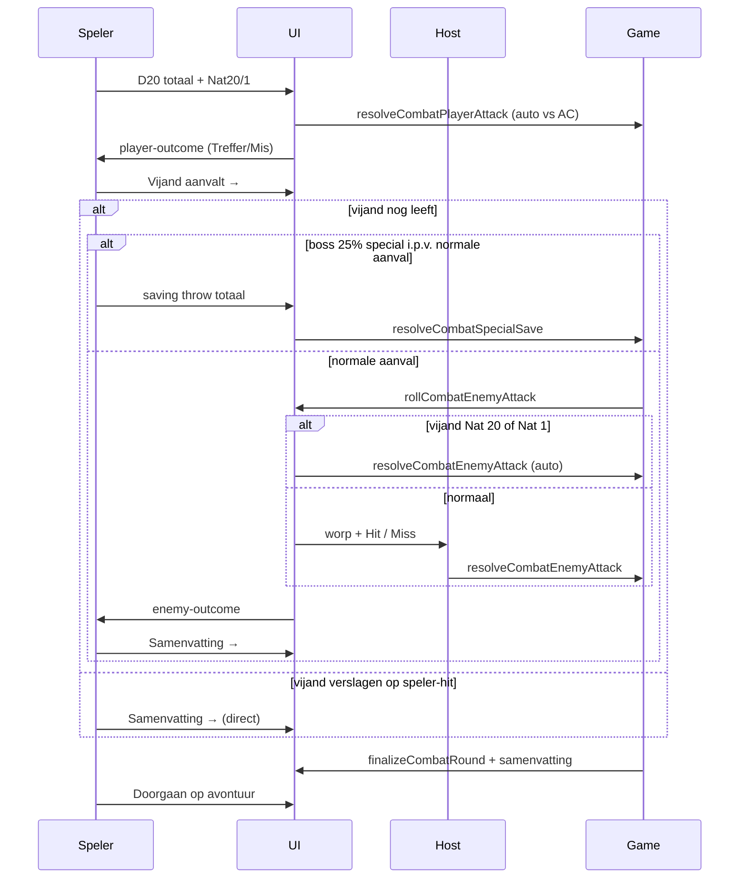

# Sessie 10 — Attack Roll Combat

**Status:** geïmplementeerd (naslag)

## Doel

Ambush-, minion- en boss-gevechten gebruiken **attack rolls**: speler-aanval vs **AC** (automatisch in app), vijand-aanval met **host Hit/Miss** na D20+to hit (behalve Nat 20/1).

Normale vak-events (trap, combat, magic, …) blijven DC-checks.

---

## Spelregels (zoals gebouwd)

### Speler-aanval
1. Speler gooit fysiek D20 + eigen modifiers (buiten app).
2. Vult totaal in; **Nat 20 / Nat 1** alleen via checkbox (totaal 20/1 telt niet automatisch).
3. **Automatische hit:** worp ≥ **AC** (`config.dc` + difficulty-modifiers via `getEffectiveDc`).
4. **Nat 20:** auto-hit → schade `2 + dmgBonus` op vijand.
5. **Nat 1:** auto-miss → geen schade; vijand-fase volgt wel (tenzij vijand al verslagen).
6. **Normale hit:** schade `1 + dmgBonus` op vijand.

Modal toont **AC** (niet Attack +X). Geen host Hit/Miss voor de speler.

### Vijand-aanval (na speler-fase, alleen als vijand nog leeft)

**Schade-basis:** `Math.ceil(config.dmg × multiplier)` — dezelfde multiplier als bij een normale vijand-hit (ambush: `pit.dmgPerHit`; boss/minion: `bossDmgPerHit`).

1. App rolt `D20 + attackBonus` — getoond als `16 + 3 = 19 To hit`.
2. **Nat 20:** auto-hit, geen host-knoppen → **dubbele schade** op speler (`2 × ceil(dmg × multiplier)`).
3. **Nat 1:** auto-miss op speler → vijand raakt **zichzelf** voor **1 HP**. Geen schade op de speler.
4. **Anders:** host klikt **Hit** of **Miss**.
5. Bij hit: schade `ceil(dmg × multiplier)` op speler (×2 bij vijand-Nat 20, zie punt 2).
6. Speler had **Nat 1** op eigen aanval → in de vijand-fase extra **+1 HP** bovenop berekende schade (normale hit **en** special attack).

**Meerdere HP-verlies:** schade loopt via `applyRepeatedHpDamage()` — stopt zodra de speler **sterft** (geen overflow op respawn-HP).

### Special attack (boss only)
- **25% kans** aan start van de vijand-fase: eindbaas gebruikt **special attack i.p.v.** normale to-hit-aanval (niet minions/ambush).
- Geen normale vijand-hit in dezelfde ronde wanneer special wordt gekozen.
- Speler rolt saving throw, vult totaal in.
- **Automatische** vergelijking vs `specialAttack.dc`.
- Slagen → `specialAttack.dmgSuccess` HP; falen → `specialAttack.dmgFail` HP (via `applyRepeatedHpDamage`).
- Speler had **Nat 1** op eigen aanval → **+1 HP** bovenop `dmgSuccess` / `dmgFail` (zelfde regel als punt 6).

### Mystery-ambush reset
- Verslaat een speler een ambush die via **❓-D12** is onthuld, dan wordt het vak na `finalizeCombatRound` weer **❓** (`resetMysterySpace`).
- `flow.wasMysteryAmbush` wordt bij gevechtsstart opgeslagen (fallback als `revealedSpaces` intussen wijzigt).

### Boss/minion: blijven op de arena (geen retreat)
- Na elke gevechtsronde op **62/63**: `pass-turn`, speler **blijft op vak** (zelfde patroon als ambush-put).
- **Geen** teleport naar vak 56 meer (`boss-retreat` is uit `finalizeCombatRound` gehaald).
- Volgende beurt op 62/63 → `advanceTurn()` opent automatisch weer het gevecht.

### Genezer vak 56
- Vast vak **`HEALER_TILE`** (`type: 'healer'`) — geen shuffle.
- Landing → `healPlayerToFull()` zet HP naar `player.maxHp` → path-modal als genezer (`showHealerModal`).
- Al vol HP → geen mutatie, wel flavor-modal.
- Zie `events-data.js`: `HEALER_SPACE`, `HEALER_TILE` (aliases `ENCAMPMENT_*` deprecated).

### Wat blijft hetzelfde
- Gedeelde HP (put / boss), death-flow, jackpot `dmgBonus`, D12 boss-reveal (één keer per fight), combat-rail, beurt-prioriteit.
- `getEffectiveDc` voor speler-AC; DC-streak / `nextDcMod` worden bij speler-aanval wel verbruikt (`nextDcMod = 0` na worp).

---

## Verschil met sessie 4/8

| | Sessie 4/8 (DC-check) | Sessie 10 (attack roll) |
|---|----------------------|-------------------------|
| Speler-worp | vs `effectiveDc` (auto) | vs **AC** (auto) |
| Speler hit/miss | Automatisch | Automatisch (geen host) |
| Mislukken | Direct speler-schade | Vijand-aanvalsfase |
| Vijand-worp | Geen | Auto D20+attackBonus; host Hit/Miss (behalve Nat 20/1) |
| Nat 20/1 speler | Op check | Op speler-aanval |
| Nat 20/1 vijand | — | Dubbele dmg op speler / **1 HP** self damage op vijand |
| Boss extra | — | Special attack + saving throw |
| Na ronde boss/minion | (was: retreat 56) | **Blijf op 62/63** |

---

## UI-flow (meerfasig)

Elke ronde is opgesplitst in duidelijke stappen. Tussenstappen gebruiken de **grote knop onderaan** (`#event-close`, herlabeld als “Vijand aanvalt →” of “Samenvatting →”). Pas op het einde: **“Doorgaan op avontuur”**.

| Fase | Wat de speler ziet |
|------|-------------------|
| `player-roll` | Aanvalsworp invoeren + AC |
| `player-outcome` | Treffer/Mis + schade/HP → knop **Vijand aanvalt →** (of **Samenvatting →** als vijand verslagen) |
| `enemy-hit` | Vijand-worp + host Hit/Miss (overgeslagen bij Nat 20/1) |
| `enemy-outcome` | Vijand-resultaat → knop **Samenvatting →** |
| `special-save` | Saving throw invoeren (boss; i.p.v. normale aanval) |
| `outcome` | **Samenvatting** (zonder speler-aanvalsworp) → **Doorgaan op avontuur** |



---

## Data (`events-data.js`)

### Ambush — extra velden

```javascript
attackBonus: 3,
dmg: 1,
```

Balans: DC 9–11 → `attackBonus: 3`; DC 12 → `attackBonus: 4`. Zwaardere vijanden (Orc Patrol) → `dmg: 2`.

Ontbrekende velden worden ingevuld via `enrichCombatEvent()`. In combat-modals telt `dc` als **AC**.

### Boss — extra velden

```javascript
attackBonus: 5,
dmg: 1,
specialAttack: {
  name: 'Vuuradem',
  saveAbility: 'Dexterity',
  dc: 14,
  dmgFail: 2,
  dmgSuccess: 1,
},
```

`ability` blijft in data (flavor / backwards compat) maar wordt niet getoond in combat-modals.

Zie ook `js/EVENTS.md` voor auteur-checklist.

---

## Code-overzicht

### `game.js`

| Onderdeel | Functie |
|-----------|---------|
| Config | `copyAmbushConfig`, `copyBossConfig` — `attackBonus`, `dmg`, `specialAttack` |
| Context | `buildCombatContext(type, { allowDefeated, spaceNum, minionIndex, combatConfig })` — bij boss-minion finalize: minion via index/config ook als alle minions op 0 HP |
| Speler | `resolveCombatPlayerAttack(ctx, roll, { nat20, nat1 })` |
| Vijand roll | `rollCombatEnemyAttack(ctx)` → `{ roll, total, attackBonus, nat20, nat1 }` |
| Vijand hit | `resolveCombatEnemyAttack(ctx, { hit, enemyRoll, playerNat1 })` |
| Special | `resolveCombatSpecialSave(ctx, saveRoll, { playerNat1 })` |
| Schade-loop | `applyRepeatedHpDamage(player, events, hits)` — stopt bij `death` |
| Heal vak 56 | `healPlayerToFull(player, events)` |
| Afronding | `finalizeCombatRound(ctx, events, { wasMysteryAmbush })` — pit-clear, mystery-reset, `pass-turn`, boss-defeated (geen retreat) |
| Minion lookup | `resolveBossMinionForContext({ minionIndex, combatConfig })` — finalize na one-shot minion |

Events: `ambush-player-attack`, `ambush-enemy-attack`, `boss-player-attack`, `boss-enemy-attack`, `boss-minion-player-attack`, `boss-minion-enemy-attack`, `boss-special-save`, `mystery-reset`, `healer-visit`, `full-heal`.

Legacy log-type `boss-retreat` kan nog in oude logs voorkomen; wordt niet meer geëmit.

### `ui.js`

| Onderdeel | Beschrijving |
|-----------|--------------|
| Flow state | `createCombatFlowState(onComplete, combatConfig, spaceNum, minionIndex)` — bewaart `combatConfig`, `spaceNum`, `wasMysteryAmbush`, `minionIndex`, `eventsAppliedCount` |
| Config lookup | `getCombatConfig()` — fallback `getPitAt` / `flow.combatConfig` (nodig na kill op 0 HP) |
| Fases | `player-roll` → `player-outcome` → (`special-save` **of** `enemy-hit` → `enemy-outcome`) → `outcome` |
| Tussenknop | `#event-close` herlabeld per fase (niet `#event-combat-action` als primair pad) |
| Vijand Hit/Miss | `#event-enemy-hit`, `#event-enemy-miss` in `#event-enemy-roll` |
| Vijand-worp | `#event-enemy-roll-display` — formaat `roll + bonus = total To hit` |
| Special save | `#event-special-save` — saving throw vs DC (auto) |
| Samenvatting | `buildCombatOutcomeHtml` — **geen** speler-aanvalsworp; wel beide fases in tekst |
| Genezer | `showHealerModal()` — hergebruikt `#path-modal` |
| MP sync | `syncCombatModalPhase` / `combatPhase` in `activeModal` |

#### `eventsAppliedCount` (meerfasige UI)

Combat past game state **per fase** toe (`applyNewCombatEvents` na speler-hit, vijand-hit, special save), niet alles pas in de samenvatting. Daardoor updaten HP-balk, log en bord tussentijds.

`flow.eventsAppliedCount` telt hoeveel events uit `flow.pendingEvents` al via `applyCombatEvents` (log + tokens + board) zijn verwerkt.

Bij **Samenvatting →** roept `finishCombatRound` `finalizeCombatRound` aan; die voegt alleen afrond-events toe (`pass-turn`, `ambush-end`, …). Daarna:

```javascript
const newEvents = finalResult.events.slice(flow.eventsAppliedCount);
await applyNewCombatEvents(flow, newEvents);
```

Zo worden speler-/vijand-events **niet dubbel** gelogd of dubbel op HP toegepast. Bij bugs (dubbele logregels, HP springt) eerst `eventsAppliedCount` vs. lengte `pendingEvents` controleren.

`#event-combat-adjudicate` (speler Hit/Miss) is **niet in gebruik** — speler-aanval is automatisch.

### `index.html` + `css/styles.css`
- Combat-blokken in event-modal (`event-enemy-roll`, `event-special-save`)
- Regels-panel: attack rolls vs AC + vijand host-adjudicate + genezer (56)

---

## Handmatige testchecklist

- [ ] Ambush: speler hit → **player-outcome** → vijand counter → **enemy-outcome** → samenvatting
- [ ] Ambush: speler miss → geen vijand-schade → vijand aanvalt
- [ ] Speler Nat 20 → auto-hit, `2 + dmgBonus`
- [ ] Speler Nat 1 → auto-miss; bij vijand-hit `dmg + 1` extra
- [ ] Vijand Nat 20 → auto-hit, dubbele schade op speler
- [ ] Vijand Nat 1 → **1 HP** self damage op vijand, geen schade speler
- [ ] Vijand dood op speler-hit (o.a. crit) → geen vijand-fase → **Samenvatting →** werkt
- [ ] Meerdere dmg hits + dood → respawn op start met vol `DEFAULT_HP` (geen overflow)
- [ ] Mystery-ambush verslagen → vak wordt weer ❓
- [ ] Boss minion: zelfde flow; **blijf op 62/63** na ronde
- [ ] Boss: special attack ~25% i.p.v. normale aanval; save auto vs DC
- [ ] Laatste minion one-shot → **Samenvatting →** werkt (`minionIndex` + `resolveBossMinionForContext`)
- [ ] Boss verslagen op 62 → geen tweede D12; doorlopen naar 63 voor win
- [ ] Genezer vak 56 → vol HP; al vol → geen HP-change
- [ ] Mystery multiplier: vijand-dmg schaalt met `pit.dmgPerHit`
- [ ] Boss D12 multiplier: vijand-dmg schaalt met `bossDmgPerHit`
- [ ] Multiplayer: gast ziet fases via `renderSpectatorModal`; host bedient knoppen
- [ ] Normale vak-events: nog steeds DC-check

---

## Gerelateerd

- Ambush / put: `MD/sessie-4-ambush.md`
- Boss: `MD/sessie-3-boss-win.md`, `MD/sessie-8-boss-d12.md`
- Nat 20/1: `MD/sessie-2-nat-overshoot.md`
- Mystery / ❓: `MD/sessie-7-mystery-vakjes.md`
- HP / death: `MD/hp-systeem.md`
- Data-schema: `js/EVENTS.md`
