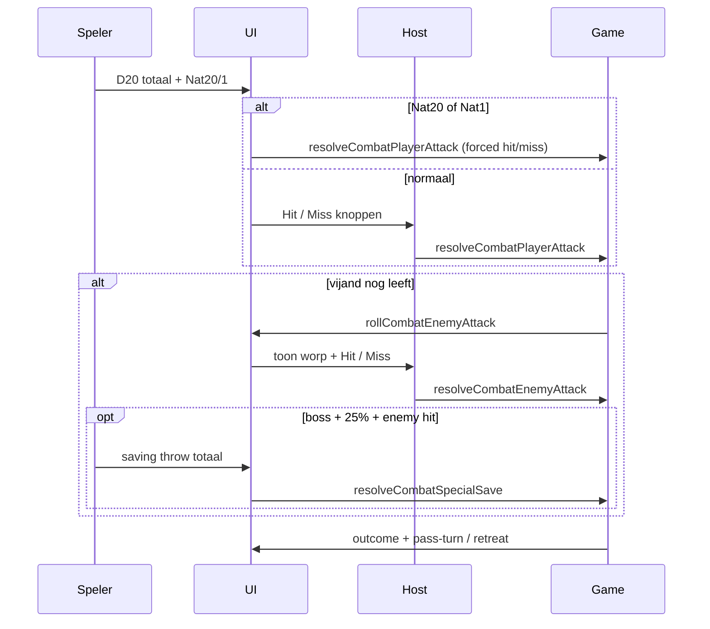

# Sessie 10 — Attack Roll Combat

**Status:** geïmplementeerd (naslag)

## Doel

Ambush-, minion- en boss-gevechten gebruiken **attack rolls**: speler-aanval vs **AC** (automatisch), vijand-aanval met **host Hit/Miss** na D20+to hit.

Normale vak-events (trap, combat, magic, …) blijven DC-checks.

---

## Spelregels (zoals gebouwd)

### Speler-aanval
1. Speler gooit fysiek D20 + eigen modifiers (buiten app).
2. Vult totaal in; **Nat 20 / Nat 1** alleen via checkbox.
3. **Automatische hit:** worp ≥ **AC** (`config.dc` + difficulty-modifiers).
4. **Nat 20:** auto-hit → schade `2 + dmgBonus` op vijand.
5. **Nat 1:** auto-miss → vijand aanvalt; bij vijand-hit extra **+1 HP**.
6. **Normale hit:** schade `1 + dmgBonus` op vijand.

Modal: **AC** + regel **Vijand: +X to hit · Y dmg**.

### Vijand-aanval (na speler-fase, alleen als vijand nog leeft)
1. App rolt `D20 + attackBonus` — getoond als `16 + 3 = 19 To hit`.
2. Host klikt **Hit** of **Miss**.
3. Bij hit: schade `Math.ceil(config.dmg × multiplier)` op speler.
   - Ambush: multiplier = `pit.dmgPerHit` (mystery ×1 / ×1.5 / ×2)
   - Boss/minion: multiplier = `game.bossDmgPerHit` (D12-tier)

### Special attack (boss only)
- **25% kans** na succesvolle vijand-hit op eindbaas (niet minions/ambush).
- Speler rolt saving throw, vult totaal in.
- **Automatische** vergelijking vs `specialAttack.dc`.
- Slagen → `specialAttack.dmgSuccess` HP; falen → `specialAttack.dmgFail` HP.

### Wat blijft hetzelfde
- Gedeelde HP (put / boss), retreat naar vak 56, death-flow, jackpot `dmgBonus`, D12 boss-reveal, combat-rail, beurt-prioriteit.
- `getEffectiveDc`, DC-streak, `nextDcMod` — **niet** van toepassing op combat attack rolls.

---

## Verschil met sessie 4/8

| | Sessie 4/8 (DC-check) | Sessie 10 (attack roll) |
|---|----------------------|-------------------------|
| Speler-worp | vs `effectiveDc` in code | Host kiest Hit/Miss |
| Mislukken | Direct speler-schade | Vijand-aanvalsfase |
| Vijand-worp | Geen | Auto D20+attackBonus, host Hit/Miss |
| Nat 20/1 | Op speler-check | Alleen speler-aanval |
| Boss extra | — | Special attack + saving throw |

---

## Data (`events-data.js`)

### Ambush — extra velden

```javascript
attackBonus: 3,
dmg: 1,
```

Balans: DC 9–11 → `attackBonus: 3`; DC 12 → `attackBonus: 4`. Zwaardere vijanden (Orc Patrol) → `dmg: 2`.

### Boss — extra velden

```javascript
attackBonus: 5,
dmg: 1,
specialAttack: {
  name: 'Vuuradem',
  saveAbility: 'Dexterity',
  dc: 14,
  dmgFail: 2,
  dmgSuccess: 1,
},
```

`dc` en `ability` blijven in data (backwards compat / flavor) maar worden niet getoond in combat-modals.

---

## Code-overzicht

### `game.js`

| Onderdeel | Functie |
|-----------|---------|
| Config | `copyAmbushConfig`, `copyBossConfig` — `attackBonus`, `dmg`, `specialAttack` |
| Speler | `resolveCombatPlayerAttack(ctx, roll, { nat20, nat1, hit })` |
| Vijand roll | `rollCombatEnemyAttack(ctx)` → `{ roll, total, attackBonus }` |
| Vijand hit | `resolveCombatEnemyAttack(ctx, { hit, enemyRoll, playerNat1 })` |
| Special | `resolveCombatSpecialSave(ctx, saveRoll)` |
| Afronding | `finalizeCombatRound(ctx, events)` — pit-clear, retreat, boss-defeated |

Events: `ambush-player-attack`, `ambush-enemy-attack`, `boss-player-attack`, `boss-enemy-attack`, `boss-minion-player-attack`, `boss-minion-enemy-attack`, `boss-special-save`.

### `ui.js`

| Onderdeel | Beschrijving |
|-----------|--------------|
| Fases | `player-roll` → `player-hit` → `enemy-roll` → `enemy-hit` → `special-save` → `outcome` |
| Knoppen | `#event-combat-hit`, `#event-combat-miss` (host) |
| Vijand-worp | `#event-enemy-roll` — auto-roll weergave |
| Special save | `#event-special-save` — D20 totaal vs DC (auto) |
| Combat badge | "Aanvalsworp" + `Attack +X · Dmg Y` i.p.v. DC |

### `index.html` + `css/styles.css`
- Combat-adjudicate blokken in event-modal
- Regels-panel bijgewerkt

---

## UI-flow (mermaid)



---

## Handmatige testchecklist

- [ ] Ambush: speler hit → vijand HP omlaag → vijand counter-aanval
- [ ] Ambush: speler miss → geen vijand-schade → vijand aanvalt
- [ ] Nat 20 → auto-hit, `2 + dmgBonus`
- [ ] Nat 1 → auto-miss, vijand-hit geeft `dmg + 1` extra
- [ ] Vijand dood op speler-hit → geen vijand-fase
- [ ] Boss minion: zelfde flow + retreat naar 56
- [ ] Boss: special attack ~25% na vijand-hit; save auto vs DC
- [ ] Mystery multiplier: vijand-dmg schaalt met `pit.dmgPerHit`
- [ ] Boss D12 multiplier: vijand-dmg schaalt met `bossDmgPerHit`
- [ ] Multiplayer: gast ziet fases; host bedient knoppen
- [ ] Normale vak-events: nog steeds DC-check

---

## Gerelateerd

- Ambush / put: `MD/sessie-4-ambush.md`
- Boss: `MD/sessie-3-boss-win.md`, `MD/sessie-8-boss-d12.md`
- Nat 20/1: `MD/sessie-2-nat-overshoot.md`
- `dmgBonus`: `MD/sessie-7-mystery-vakjes.md`
